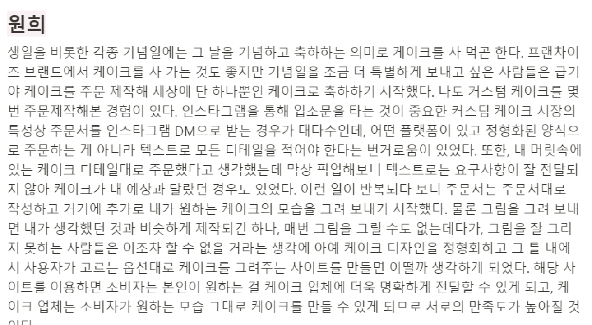

# CakeN

주문제작 케이크 디자인 플랫폼

# 기획의도

주문제작 케이크 예약 시 너무나도 다양한 디자인 형태가 존재하고, 상상하는 디자인을 그대로 표현하기에 어려움이 있다는 문제의식을 제기하였습니다.

## 브레인스토밍




👥 “난 창의력이 부족해 .. 직접 만들지 않고 다른 사람들의 디자인을 참고하고 싶어! 완벽한 내 디자인을 많은 사람들에게 자랑하고 싶어!”

→ 💭 자신이 만든 디자인을 자랑하고 다른 사용자들이 원하는 디자인을 그대로 가져올 수 있다면?

👥 “레터링 문구는 또 어떤 걸로 정해야 하지.. 정해야 할 게 너무 많아!!”

→ 💭 레터링 문구 추천 리스트도 함께 제공함으로써 좋아요한 문구를 가져오도록 하자!


<aside>
💡 정형화된 **케이크 디자인 프레임**을 만들고 세부 기능으로 자신이 만든 디자인을 자랑하는 **콘테스트 기능**과 다양한 **레터링 문구 추천** 목록을 제공하자!

</aside>

## 앱 구조도(IA)


## 와이어프레임


## 데이터베이스 ERD
[ERD 링크](https://www.erdcloud.com/d/GxgKY5jcHiAKEBohh)


# Tools

- Java/SpringBoot
- Spring Security
- Spring Validation
- Spring Data
- JPA
- OAuth2.0
- React
- Thymeleaf
- Notion
- Slack
- Figma
- Gather
- GitKraken

# ****Contributions****

### [박예준](https://github.com/jun02160)

```python
- CakeN 팀장
- 기획
- 데이터베이스 설계
- 백엔드 개발
- User App(Security) 구현
- Design App 구현
```

### [김원희](https://github.com/wonandonly)

```python
- 기획
- 프론트엔드 개발
- Letter Page
- Main Page
```

### [남유민](https://github.com/noom216)

```python
- 기획
- 프론트엔드 개발
- User Page
```

### [최민영](https://github.com/min02choi)

```python
- 기획
- 데이터베이스 설계
- 백엔드 개발
- Contest App 구현
- Letter App 구현
```
